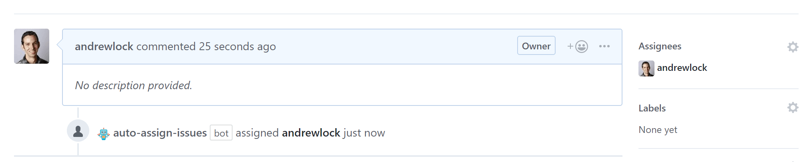

> This app is now deprecated, as GitHub are deprecating the APIs it relies on.
> Instead, I suggest you use a GitHub action to achieve the same effect
> For example, https://github.com/marketplace/actions/auto-assign-issue. 
> you can read about this approach in [my blog post](https://andrewlock.net/auto-assigning-issues-using-a-github-action/)

# Probot: Auto Assign Issues

> A GitHub App built with [Probot](https://github.com/probot/probot) that auto-assigns any issues raised in a repository to specific users.
 


## How it works
* When an issue is created on the repository, automatically assigns people to the pull request.
* If a list of assignees is provided in configuration, adds them all to the issue.
* If no assignees are provided, assigns the owner of the repository to the Issue.

## Usage
1. [Install the app](https://github.com/apps/auto-assign-issues).
2. Optionally create `.github/auto-assign-issues.yml` in your repository.

```yaml
# If enabled, auto-assigns users when a new issue is created 
# Defaults to true, allows you to install the app globally, and disable on a per-repo basis
addAssignees: true

# The list of users to assign to new issues. 
# If empty or not provided, the repository owner is assigned
assignees:
  - reviewerA
  - reviewerB
  - reviewerC
```

When a new issue is created on the repository, one of the assignees or the repo owner will be assigned.

## Development

```sh
# Install dependencies
npm install

# Run typescript
npm run build

# Run the bot
npm start

# Test before submitting a PR
npm test
```

If you have suggestions for how `auto-assign-issues` could be improved, or want to report a bug, open an issue! We'd love all and any contributions.

For more, check out the [Contributing Guide](CONTRIBUTING.md).

## License

[ISC](LICENSE) © 2019 Andrew Lock
